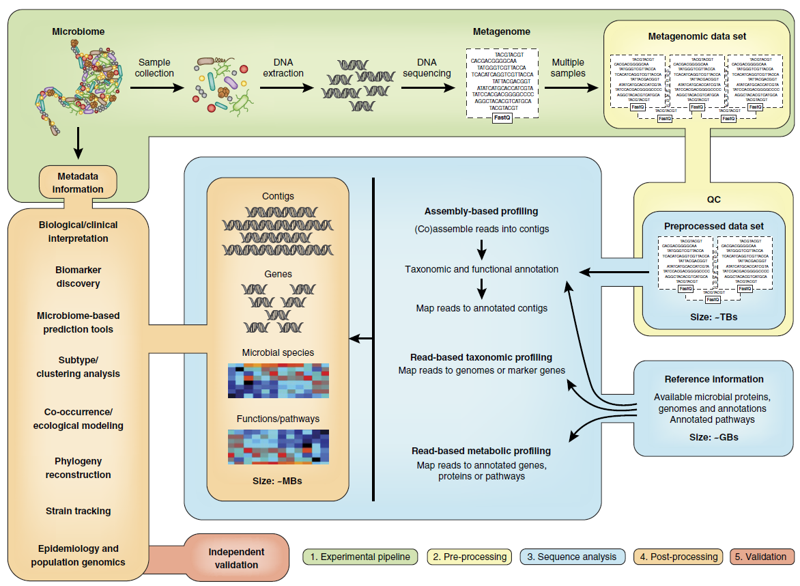
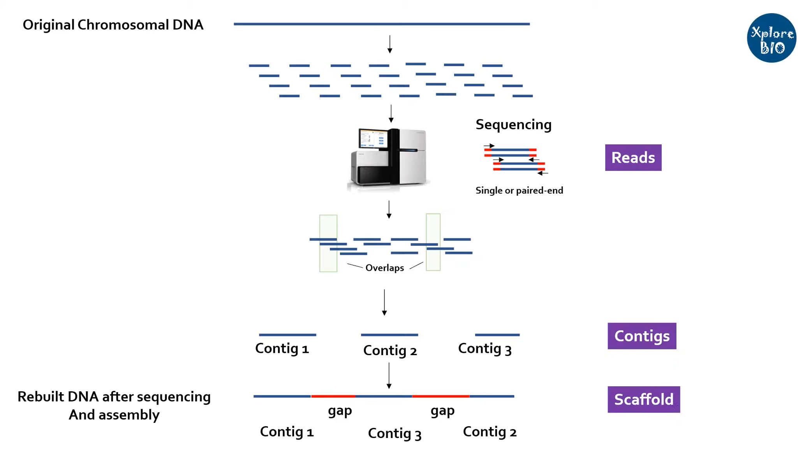

# Metagenome 笔记

主要是分为五个步骤

## 1. Experimental pipeline

实验设计以及测序实验的进行，最后得到测序的结果

- **实验设计**
1. 对照组的样本可能很难获得，特别是对于来自复杂环境的样品。因为微生物含量可以在同一环境下的不同样品之间变化，这使得在小组样品之间检测统计意义和生物学意义的差异变得复杂。一般来说建议进行纵向研究，将来自同一生境的样本随时间推移纳入研究，而不是简单的横向研究，比较不同生境的样本
2. 如果样本来源于动物模型，特别是同居的啮齿动物，则应考虑动物年龄、居住环境甚至接触动物的人的性别对微生物群落的潜在影响。通过单独饲养动物来防止微生物在笼中不同动物之间传播，将来自不同实验群体的动物安置在同一个笼子里，或用来自不同供应商或具有不同遗传背景的老鼠进行重复实验，这些方法通常是可行的(尽管这可能会导致动物的行为变化)

- **样品采集和DNA提取**
1. 样品的提取步骤以及保存的条件会对宏基因组数据的准确性和质量产生影响。在某些情况下这些步骤的影响甚至可能会超过实验中不同组之间的差异。
2. 关键目标是收集足够的微生物生物量进行测序，并尽量减少样品的污染
3. 多篇文献证明样品采集和冷冻之间的时间长短，冻融循环次数等因素可以影响检测到的微生物群落概况。因此，样品收集保存的条件要记录下来
4. DNA提取的方法同样重要，提取方法必须对不同的微生物类群有效;否则，测序结果可能主要由仅来自易于溶解的微生物的DNA所决定。机械裂解(或珠状打浆)的方法通常被认为优于依赖化学裂解的方法
5. 同时试剂盒或实验室试剂也可能含有不同数量的微生物污染物

## 2. Pre-processing

- **Library preparation and sequencing （库准备和排序）**

1. 目前使用的平台主要是Illumina
2. 对于特定环境或研究类型的“正确”测序覆盖量，目前还没有公布的指导方针，也不太可能存在这样的数字。一般来说根据经验，建议选择最大限度的数据输出，以便检索尽可能多的低丰度的微生物组成员

- **FastQC总报告信息**  

这一步中需要使用FastQC、Trimmomatic、Picard tools等工具进行测序结果的筛选工作，以提高样本的准确性，来使后续的实验结果更加的可信

下面对FastQC的结果进行示例讲解
  

 1. Sequence length 代表测序的长度
 2. %GC 是需要重点关注的一个指标，这个值表示的是整体序列中的GC含量，不同物种的值不一样，比如人类细胞就是42%左右。
 3. Total Sequences记录了输入文本的reads的数量

- **Per base sequence quality**
  

 1. 此图中的横轴是测序序列第1个碱基到第101个碱基 
 2. 纵轴是质量得分，Q = -10*log10（error P）即20表示1%的错误率，30表示0.1%
 3. 图中每1个boxplot，都是该位置的所有序列的测序质量的一个统计，上面的bar是90%分位数，下面的bar是10%分位数，箱子的中间的横线是50%分位数，箱子的上边是75%分位数，下边是25%分位数
 4. 图中蓝色的细线是各个位置的平均值的连线
 5. 一般要求此图中，所有位置的10%分位数大于20,也就是我们常说的Q20过滤(bar的下边不低于20,图中的结果87bp之后的要去掉)

- **Per tile sequence quality**
   

 1. 横轴同样是碱基不同的位置（1-101）
 2. 纵轴是tail的编号
 3. 蓝色代表质量好，如果出现暖色则代表该tail的质量不好，在后续的实验中要把它去掉
   
- **Per sequence quality scores**
  

 1. 横轴是0-40，表示Q值,即质量
 2. 纵轴是每个值对应的reads数目
 3. 观察测序结果所集中的Q值，越高越好

- **Per base sequence content** 
  
  

 1. 横轴是1 - 101 bp；纵轴是百分比
 2. 图中四条线代表A T C G在每个位置平均含量
 3. 理论上来说，A和T应该相等，G和C应该相等，但是一般测序的时候，刚开始测序仪状态不稳定，就会出现上图的情况。像这种情况，即使测序的得分很高，也需要cut开始部分的序列信息。一般像碰到这种情况，会cut前面5bp

- **Per sequence GC content**
  
  

 1.  横轴是0 - 100%, 纵轴是每条序列GC含量对应的数量
 2.  蓝色的线是程序根据经验分布给出的理论值，红色是真实值，两个应该比较接近才比较好
 3.  当红色的线出现双峰，基本肯定是混入了其他物种的DNA序列(图中的结果比较好)

- **Sequence length distribution**
  
  

 1. 每次测序仪测出来的长度在理论上应该是完全相等的，但是总会有一些偏差
 2. 比如此图中，101bp是主要的，但是还是有少量的100和102bp的长度，不过数量比较少，不影响后续分析
 3. 当测序的长度不同时，如果很严重，则表明测序仪在此次测序过程中产生的数据不可信 

- **Adapter content**
  
  
  

  关于adapter、barcode、insert序列的简介以及如何去adapter[**见此**](https://blog.csdn.net/sinat_38163598/article/details/72857172)

 1. 此图衡量的是序列中两端adapter的情况
 2. 如果在当时fastqc分析的时候-a选项没有内容，则默认使用图例中的四种通用adapter序列进行统计
 3. 本例中adapter都已经去除，如果有adapter序列没有去除干净的情况，在后续分析的时候需要先使用软件进行去接头

- **Kmer content** 
   
  

 1. 这个图统计的是，在序列中某些特征的短序列重复出现的次数
 2. 可以看到1-8bp的时候图例中的几种短序列都出现了非常多的次数，一般来说，出现这种情况，要么是adapter没有去除干净，而又没有使用-a参数；要么就是序列本身可能重复度比较高，如建库PCR的时候出现了bias
 3. 对于这种情况，办法是可以cut掉前面的一些长度，可以试着cut 5~8bp

## 3. Sequence analysis

目前已有许多从测序结果中计算重建微生物群落组成的方法。选择“最好的”是一项艰巨的任务，在很大程度上取决于研究的目的。

**关于宏基因组分析方法[**见2.1-2.5**](https://zhuanlan.zhihu.com/p/106405153)**

- **Reads contigs scatffolds 定义**

1. shotgun打碎后得到的150bp-300bp的能够得到准确测序结果的小片段叫做**reads**
2. 经过de bruijn图算法堆叠后形成的稍长一点的片段叫做**contigs**
3. 最后不同的**contigs**通过比对数据库来重建整个基因组，最后得到的片段叫做**scaffold**，而这个过程叫做**binning**
   
   1. 宏基因组组合是高度碎片化的，包含数千个contigs，研究人员不知道哪个contig来自哪个基因组，甚至不知道存在多少个基因组。binning的目的是将contig分组成物种
   2. 不同的微生物物种的基因组包含特定的碱基组合，这导致了不同的k-mer频率，基于这些k-mer频率的度量可以用于分组

- **Read-based (mapping)和assembly-based两种分析策略**
  
1. 宏基因组从头组装（de novo assenmbly)在概念上与全基因组组装相似。即利用de Bruijn图，通过将每个序列读取分解成固定长度k的重叠子序列来构建整个基因条带。关于kmer和de Bruijn的定义[**见此**](https://zhuanlan.zhihu.com/p/57177938) 
   
    1. assembly-based approach 受到覆盖度的制约，因为组装时低覆盖度的区域是不会进行组装的，而是被丢弃，这样低丰度的细菌的信息就被丢弃了，反映在reads利用率上，就是往往reads利用率极低，往往低于50%。
    2. assembly-based approach 特别适用于微生物组研究尤其是包含大量以前未观测到（未测序）微生物，被部分参考序列覆盖的宏基因数据。assembly-based approach 的优势在于，他们不依赖于参考基因组的使用，而其他分析方法则会缺失群落中部分新的微生物信息
    3. 宏基因组的拼接很困难，因为每个基因组的覆盖范围取决于群落中每个基因组的丰度。低丰度的基因组可以通过调低kmer恢复，但这样重复kmer的频率会增加，使得基因的正确重建有更多的困难
    4. 除此之外，还有一个问题是，一个样本可能含有同一种细菌的不同菌株。这些密切相关的基因组可以在组装图中引起分支，它们可能因单个核苷酸变异或整个基因或操纵子的存在或不存在而不同。汇编程序通常会在这些分支点停止，从而导致分段重构
    5. 目前有使用多重kmer的方式来解决以上的困难（Meta-IDBA）
   
2. read-based (mapping) approach 则受到reference databases的制约，因为细菌的遗传多样性很高，即便是同一个菌种，它的不同菌株，其基因组的组成也是有相对比较大的差异的，那么在mapping的时候就会出现mapping不上的问题，使得mapping效率不够高；而且只能分析reference databases中有的物种，对于reference databases未收录的新物种，是无法进行分析的。

 |         | Assembly-based analysis | Read-based analysis （'mapping') |
 | :----: | :-----: | :-----: |
 | 全面性 | 可以构建多个完整的基因组，但只适用于具有足够覆盖范围的生物体，以便组装和归类| 是否可以提供群落功能或结构的聚合图，但仅基于有效映射到引用数据库的读取部分 |
 |群落复杂性|在复杂的群落中，只有一小部分基因组可以通过组装来分解|在足够的测序深度和满意的参考数据库覆盖范围下，能否处理任意复杂的群落|
 |新颖性|能够解析没有已知序列的亲缘关系的全新生物体基因组|无法分辨近亲基因组未知的生物体|
 |计算负担|需要长时间的计算assembly，mapping和binning|能够高效地执行，从而实现大型meta分析|
 |基因组相关的代谢|即使对于新的多样性，可以通过完全组装的基因组将代谢与系统发育联系起来|通常只能解决群落的聚集代谢，并且与系统发育的联系仅能在已知的参考基因组的背景下分析|
 |人工监督|为了准确的binning和scaffolding以及错误assembly的检测，需要人工管理|通常不需要人工管理，但是参考基因组的选择可能需要人工完成|
 |与微生物基因组学的整合|组件可以输入微生物基因组管道用于分析纯培养分离物的基因组|获得的图谱不能直接放入从纯培养的分离株中提取的基因组|
 
 不过可用的微生物参考基因组正在迅速地增加，包括那些原先难以培养的细菌由于培养方法的改进，使得对其进行测序成为可能，再加上单细胞测序的途径和 metagenomic assembly的途径得到的基因组序列。现在一些类型的环境样品（如人肠道）的参考基因组的多样性已经可以满足 assembly-free taxonomic profiling 的要求。

- **Binning的原理**

1. 根据核酸组成信息来进行binning（k-mer frequencies）
   
   1. **依据**：来自同一菌株的序列，其核算组成是相似的。例如根据核酸使用频率（oligonucleotide frequency variations），通常是四核苷酸频率（tetranucleotide frequency），GC含量和必需的单拷贝基因等
   2. **优势**：即便只有一个样品的宏基因组数据也可以进行binning，这在原理上是可操作的
   3. **不足**：由于很多微生物种内各基因型之间的基因组相似性很高，想利用1个样品的宏基因组数据通过核酸组成信息进行binning，效果往往并不理想或难度很大。利用核酸组成信息进行binning，基本上只适合那些群落中物种基因型有明显核酸组成差异的，例如低GC含量和一致的寡核苷酸使用频率
2. 根据丰度信息来binning
   1. **依据**：来自同一个菌株的基因在不同的样品中 ( 不同时间或不同病理程度 ) 的丰度分布模式是相似的
   2. **解释**：比如，某一细菌中有两个基因，A和B，它们在该细菌基因组中的拷贝数比例为 A:B = 2:1，则不管在哪个样品中这种细菌的数量有多少，这两个基因的丰度比例总是为 2:1
   3. **优势**：这种方法更有普适性，一般效果也比较好，能达到菌株的水平
   4. **不足**：必须要大样本量，一般至少要50个样本以上，至少要有2个组能呈现丰度变化 ( 即不同的处理，不同的时间，疾病和健康，或者不同的采样地点等 ) ，每个组内的生物学重复也要尽量的多
3. 根据基因组甲基化模式
   1. **依据**：不同的细菌，其基因组甲基化模式不同，平均一种细菌有3种特意的甲基化 motif。MGEs (mobile genetic elements) 中含有 MTase 基因，其基因水平转移是细菌甲基化组多样性的驱动因素。虽然 MGEs 在不同个体的拷贝数不同，但是都存在，因此具有相同 MGEs 的细菌个体，其总遗传物质（包括染色体和 MGEs ）都会受到相同的MTase的作用而得到相同的甲基化模式
4. 同时依据核酸组成和丰度变化信息
   1. 将核酸组成信息和丰度差异信息创建一个综合的距离矩阵，既能保证binning效果，也能相对节约计算资源，现在比较主流的binning软件多是同时依据核酸组成和丰度变化信息

- **binning的具体操作**

从原始的clean reads，还是从组装成的contig，还是从预测到的gene，都可以。根据基于聚类的序列类型的不同，暂且分为reads binning， contig binning和 genes binning

1. **contig binning**
   
   1. 由于核酸组成和物种丰度变化模式在越长的序列中越显著和稳定，基于contig binning效果可能更好 
2. **reads binning**

   1. 基于reads binning的优势是可以聚类出宏基因组中丰度非常低的物种

   2. 考虑到在宏基因组组装中reads利用率很低，单样品5Gb测序量情况下，环境样品组装reads利用率一般只有10%左右，肠道样品或极端环境样品组装reads利用率一般能达到30%，这样很多物种，尤其是低丰度的物种可能没有被组装出来，没有体现在gene 或者contig 中，因此基于reads binning 才有可能得到低丰度的物种

   3. 如 Brian Cleary 等 (DOI:10.1038/nbt.3329.Detection) 利用基于 reads binning 的 latent strain analysis 可以聚类出丰度低至0.00001%的菌株。此方法虽然得到更全面的 bins，但低丰度 bins 信息依旧不完整。 
3.  **genes binning**
    1.  应用非常广泛。原因可能是（1）基于genes丰度变化模式进行binning可操作性比较强，宏基因组分析中肯定都会计算gene丰度，一般不会计算contig丰度，gene丰度数据可以信手拈来；（2）基于genes binning有很多可参考的文献，过程也并不复杂，可复制性强；（3）对计算机资源消耗比较低
   
**总体来说应用最广泛的就是基于genes binning 和 contig binning**

- **Assembly-free metagenomic profilling**

宏基因组的分类分析确定了哪些微生物物种存在于宏基因组中，并估计了它们的丰度。这可以通过外部序列数据资源(如公开可用的参考基因组)来实现，而无需组装

1. 这种方法可以缓解组装问题，加快计算速度，并能对无法从头组装的低丰度生物体进行剖面分析。它的主要限制是难以对以前未被鉴定的微生物进行剖析
2. 近年来可用的参考基因组数量正在迅速增加（如人肠道），已经可以满足参考要求
3. 由于缺乏具有代表性的参考基因组，对包括土壤和海洋在内的更多样化环境的分析受到了阻碍。因此，在分析来自这些环境的宏基因组时，通常建议使用组装。
4. 通过从现有的参考序列中选择具有代表性或区别性的基因(标记)进行分类分析是另一种快速和准确的无组合方法

   

## 4. Post-processing

## 5. Validation
